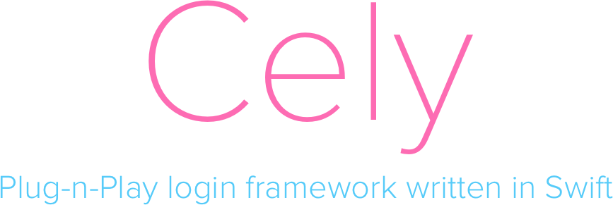
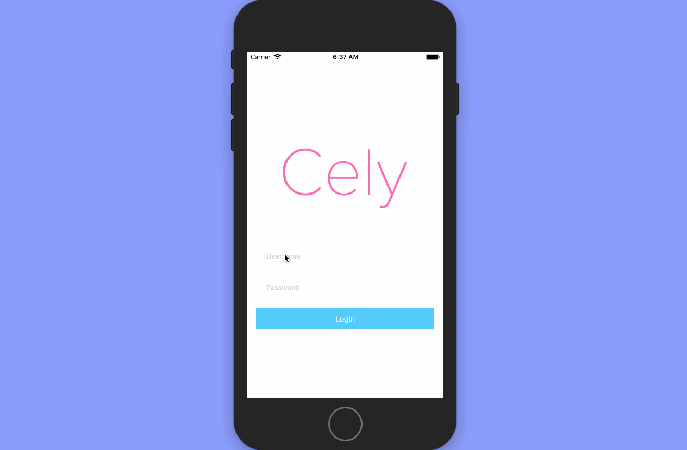

<div style="text-align:center"></div>


[](https://github.com/Carthage/Carthage)
[](https://cocoapods.org/pods/Cely)
[](http://github.com/cookiecutter-swift/Framework)
[](https://app.bitrise.io/app/aff729145cb46dfe)
[](https://codecov.io/gh/initFabian/Cely)
> Prounounced Cell-Lee

Cely’s goal is to add a login system into your app in under 30 seconds!

- [Overview](#overview)
- [Requirements](#requirements)
- [Usage](#usage)
- [API](#api)
- [Installation](#installation)
- [License](#license)

## Overview
Cely's goal is to add a login system into your app in under 30 seconds! 



### Background
Whether you're building an app for a client or for a hackathon, building a login system, no matter how basic it is, can be very tedious and time-consuming. Cely's architecture has been battle tested on countless apps, and Cely guarantees you a fully functional login system in a fraction of the time. You can trust Cely is handling login credentials correctly as well since Cely is built on top of [Locksmith](https://github.com/matthewpalmer/Locksmith), swift's most popular Keychain wrapper. 

#### Details:
What does Cely does for you? 

1. Simple API to store user creditials and information **securely**
 - `Cely.save("SUPER_SECRET_STRING", forKey: "token", securely: true)`
2. Manages switching between your app's Home Screen and Login Screen with:
 - `Cely.changeStatus(to: .loggedIn) // or .loggedOut`
3. Customizable starter Login screen(or you can use your login screen)
 
What Cely **does not do** for you? 

1. Network requests
2. Handle Network errors
3. Anything with the network 

## Requirements

- iOS 11.0+ <!-- / Mac OS X 10.10+ / tvOS 9.0+ / watchOS 2.0+ -->
- Xcode 9.0+
- Swift 4.0+

## Usage

### Setup(30 seconds)

#### User Model (`User.swift`)
Let's start by creating a `User` model that conforms to the [`CelyUser`](#Cely.CelyUser) Protocol:

```swift
// User.swift

import Cely

struct User: CelyUser {

  enum Property: CelyProperty {
    case token = "token"
  }
}

```
#### Login redirect(`AppDelegate.swift`)

Cely's **Simple Setup** function will get you up and running in a matter of seconds. Inside of your `AppDelegate.swift` simply `import Cely` and call the [`setup(_:)`](#Cely.setup) function inside of your `didFinishLaunchingWithOptions` method.

```swift
// AppDelegate.swift

import Cely

func application(application: UIApplication, didFinishLaunchingWithOptions launchOptions: [NSObject: Any]?) -> Bool {
  
  Cely.setup(with: window, forModel: User(), requiredProperties: [.token])
  
  ...
}
```

<h3 style="text-align: center">Hit RUN!!</h3>

### CelyOptions
#### Handle Login Credentials
Now how do we get the `username` and `password` from Cely's default LoginViewController? It's easy, just pass in a completion block for the `.loginCompletionBlock`. Check out [`CelyOptions`](#Cely.CelyOptions) for more info.

```swift

func application(_ application: UIApplication, didFinishLaunchingWithOptions launchOptions: [UIApplicationLaunchOptionsKey: Any]?) -> Bool {

    Cely.setup(with: window!, forModel: User(), requiredProperties: [.token], withOptions: [
        .loginCompletionBlock: { (username: String, password: String) in
            if username == "asdf" && password == "asdf" {
                Cely.save(username, forKey: "username")
                Cely.save("FAKETOKEN:\(username)\(password)", forKey: "token", securely: true)
                Cely.changeStatus(to: .loggedIn)
            }
        }
    ])

    return true
}
```
#### Customize Default Login Screen

Create an object that conforms to the [`CelyStyle`](#Cely.CelyStyle) protocol and set it to `.loginStyle` inside of the [`CelyOptions`](#Cely.CelyOptions) dictionary when calling Cely's [`setup(_:)`](#Cely.setup) method.

```swift
// LoginStyles.swift
struct CottonCandy: CelyStyle {
    func backgroundColor() -> UIColor {
        return UIColor(red: 86/255, green: 203/255, blue: 249/255, alpha: 1) // Changing Color
    }
    func buttonTextColor() -> UIColor {
        return .white
    }
    func buttonBackgroundColor() -> UIColor {
       return UIColor(red: 253/255, green: 108/255, blue: 179/255, alpha: 1) // Changing Color
    }
    func textFieldBackgroundColor() -> UIColor {
        return UIColor.white.withAlphaComponent(0.4)
    }
    func appLogo() -> UIImage? {
        return UIImage(named: "CelyLogo")
    }
}

...

// AppDelegate.swift

func application(_ application: UIApplication, didFinishLaunchingWithOptions launchOptions: [UIApplicationLaunchOptionsKey: Any]?) -> Bool {

    Cely.setup(with: window!, forModel: User.ref, requiredProperties: [.token], withOptions: [
        .loginStyle: CottonCandy(), // <--- HERE!!
        .loginCompletionBlock: { ... }        
    ])

    return true
}

```

#### Customize Transitions
In order to create a custom transition, create an object that conforms to [`CelyAnimator`](#Cely.CelyAnimator) protocol and set it to `.celyAnimator` inside of the [`CelyOption`](#Cely.CelyOptions) dictionary when calling Cely's [`setup(_:)`](#Cely.setup) method.

```swift
struct DefaultAnimator: CelyAnimator {
    func loginTransition(to destinationVC: UIViewController?, with celyWindow: UIWindow) {
        guard let snapshot = celyWindow.snapshotView(afterScreenUpdates: true) else {
            return
        }

        destinationVC?.view.addSubview(snapshot)
        // Set the rootViewController of the `celyWindow` object
        celyWindow.setCurrentViewController(to: destinationVC)

        // Below here is where you can create your own animations
        UIView.animate(withDuration: 0.5, animations: {
            // Slide login screen to left
            snapshot.transform = CGAffineTransform(translationX: 600.0, y: 0.0)
        }, completion: {
            (value: Bool) in
            snapshot.removeFromSuperview()
        })
    }

    func logoutTransition(to destinationVC: UIViewController?, with celyWindow: UIWindow) {
        guard let snapshot = celyWindow.snapshotView(afterScreenUpdates: true) else {
            return
        }

        destinationVC?.view.addSubview(snapshot)
        // Set the rootViewController of the `celyWindow` object
        celyWindow.setCurrentViewController(to: destinationVC)

        // Below here is where you can create your own animations
        UIView.animate(withDuration: 0.5, animations: {
            // Slide home screen to right
            snapshot.transform = CGAffineTransform(translationX: -600.0, y: 0.0)
        }, completion: {
            (value: Bool) in
            snapshot.removeFromSuperview()
        })
    }
}

...

// AppDelegate.swift

func application(_ application: UIApplication, didFinishLaunchingWithOptions launchOptions: [UIApplicationLaunchOptionsKey: Any]?) -> Bool {

    Cely.setup(with: window!, forModel: User.ref, requiredProperties: [.token], withOptions: [
    .celyAnimator: CustomAnimator(), // <--- HERE!!
    .loginCompletionBlock: { ... }        
    ])

    return true
}

```


#### Use your own Screens
To use your own login screen, simply create a storyboard that contains your login screen and pass that in as `.loginStoryboard` inside of the [`CelyOptions`](#Cely.CelyOptions) dictionary when calling Cely's [`setup(_:)`](#Cely.setup) method. 

Lastly, if your app uses a different storyboard other than `Main.storyboard`, you can pass that in as `.homeStoryboard`.

**⚠️⚠️⚠️⚠️ Be sure to make your Login screen as the `InitialViewController` inside of your storyboard!⚠️⚠️⚠️⚠️**

```swift

// AppDelegate.swift

func application(_ application: UIApplication, didFinishLaunchingWithOptions launchOptions: [UIApplicationLaunchOptionsKey: Any]?) -> Bool {

    Cely.setup(with: window!, forModel: User.ref, requiredProperties: [.token], withOptions: [
        .loginStoryboard: UIStoryboard(name: "MyCustomLogin", bundle: nil),
        .homeStoryboard: UIStoryboard(name: "NonMain", bundle: nil)
    ])

    return true
}

```

### Recommended User Pattern

```swift
import Cely

struct User: CelyUser {

    enum Property: CelyProperty {
        case username = "username"
        case email = "email"
        case token = "token"

        func securely() -> Bool {
            switch self {
            case .token:
                return true
            default:
                return false
            }
        }

        func persisted() -> Bool {
            switch self {
            case .username:
                return true
            default:
                return false
            }
        }

        func save(_ value: Any) {
            Cely.save(value, forKey: rawValue, securely: securely(), persisted: persisted())
        }

        func get() -> Any? {
            return Cely.get(key: rawValue)
        }
    }
}

// MARK: - Save/Get User Properties

extension User {

    static func save(_ value: Any, as property: Property) {
        property.save(value: value)
    }

    static func save(_ data: [Property : Any]) {
        data.forEach { property, value in
            property.save(value)
        }
    }

    static func get(_ property: Property) -> Any? {
        return property.get()
    }
}

```

The reason for this pattern is to make saving data as easy as:

```swift
// Pseudo network code, NOT REAL CODE!!!
ApiManager.logUserIn("username", "password") { json in
  let apiToken = json["token"].string
  
  // REAL CODE!!!
  User.save(apiToken, as: .token)
}

```
and getting data as simple as:

```swift
let token = User.get(.token)
```

## API

### Cely
Cely was made to help handle user credentials and handling login with ease. Below you will find documentation for Cely's Framework. **Please do not hesitate to open an issue if something is unclear or is missing.** 
#### Variables
<div id="Cely.store"></div>

##### `store`

A class that conforms to the [`CelyStorageProtocol`](#Cely.CelyStorageProtocol) protocol. By default is set to a singleton instance of `CelyStorage`.


#### Methods

<div id="Cely.setup"></div>

##### `setup(with:forModel:requiredProperties:withOptions:)`

Sets up Cely within your application
<details>
<summary>Example</summary>

```swift
Cely.setup(with: window, forModel: User(), requiredProperties:[.token])

// or 

Cely.setup(with: window, forModel: User(), requiredProperties:[.token], withOptions:[
  .loginStoryboard: UIStoryboard(name: "MyCustomLogin", bundle: nil),
  .HomeStoryboard: UIStoryboard(name: "My_NonMain_Storyboard", bundle: nil),
  .loginCompletionBlock: { (username: String, password: String) in
        if username == "asdf" && password == "asdf" {
            print("username: \(username): password: \(password)")
        }
    }
])
```
</details>
<details>
<summary>Parameters</summary>

Key | Type| Required? | Description
----|------|----------|--------
`window` | `UIWindow` | ✅ | window of your application.
`forModel` | [`CelyUser`](#Cely.CelyUser) | ✅ | The model Cely will be using to store data.
`requiredProperties` | `[CelyProperty]` | no | The properties that cely tests against to determine if a user is logged in. <br> **Default value**: empty array.
`options` | `[CelyOption]` | no | An array of [`CelyOptions`](#Cely.CelyOptions) to pass in additional customizations to cely.

</details>


<div id="Cely.currentLoginStatus"></div>

##### `currentLoginStatus(requiredProperties:fromStorage:)`

Will return the `CelyStatus` of the current user.
<details>
<summary>Example</summary>

```swift
let status = Cely.currentLoginStatus()
```

</details>
<details>
<summary>Parameters</summary>

Key | Type| Required? | Description
----|------|----------|--------
`properties` | [`CelyProperty`] | no | Array of required properties that need to be in store.
`store` | `CelyStorage` | no |    Storage `Cely` will be using. Defaulted to `CelyStorage`

</details>

<details>
<summary>Returns</summary>

Type| Description
----|------
[`CelyStatus`](#Cely.CelyStatus) | If `requiredProperties` are all in store, it will return `.loggedIn`, else `.loggedOut`

</details>


<div id="Cely.get"></div>

##### `get(_:fromStorage:)`

Returns stored data for key.
<details>
<summary>Example</summary>

```swift
let username = Cely.get(key: "username")
```
</details>
<details>
<summary>Parameters</summary>

Key | Type| Required? | Description
----|------|----------|--------
`key` | String | ✅ | The key to the value you want to retrieve.
`store` | CelyStorage | no | Storage `Cely` will be using. Defaulted to `CelyStorage`

</details>

<details>
<summary>Returns</summary>

Type| Description
----|------
`Any?` | Returns an `Any?` object in the case the value nil(not found).

</details>


<div id="Cely.save"></div>

##### `save(_:forKey:toStorage:securely:persisted:)`

Saves data in store
<details>
<summary>Example</summary>

```swift
Cely.save("test@email.com", forKey: "email")
Cely.save("testUsername", forKey: "username", persisted: true)
Cely.save("token123", forKey: "token", securely: true)
```
</details>
<details>
<summary>Parameters</summary>

Key | Type| Required? | Description
----|------|----------|--------
`value` | <code>**Any?**</code> | ✅ | The value you want to save to storage.
`key` | <code>**String**</code> | ✅ | The key to the value you want to save.
`store` | <code>**CelyStorage**</code> | no | Storage `Cely` will be using. Defaulted to `CelyStorage`.
`secure` | <code>**Boolean**</code> | no | If you want to store the value securely.
`persisted` | <code>**Boolean**</code> | no | Keep data after logout.

</details>

<details>
<summary>Returns</summary>

Type| Description
----|------
  `StorageResult` | Whether or not your value was successfully set.

</details>


<div id="Cely.changeStatus"></div>

##### `changeStatus(to:)`

Perform action like `LoggedIn` or `LoggedOut`.
<details>
<summary>Example</summary>

```swift
changeStatus(to: .loggedOut)
```
</details>
<details>
<summary>Parameters</summary>

Key | Type| Required? | Description
----|------|----------|--------
`status` | <code>**CelyStatus**</code> | ✅ | enum value

</details>


<div id="Cely.logout"></div>

##### `logout(usesStorage:)`

Convenience method to logout user. Is equivalent to `changeStatus(to: .loggedOut)`
<details>
<summary>Example</summary>


```swift
Cely.logout()
```
</details>
<details>
<summary>Parameters</summary>

Key | Type| Required? | Description
----|------|----------|--------
`store` | <code>**CelyStorage**</code> | no | Storage `Cely` will be using. Defaulted to `CelyStorage`.

</details>


<div id="Cely.isLoggedIn"></div>

##### `isLoggedIn()`

Returns whether or not the user is logged in
<details>
<summary>Example</summary>

```swift
Cely.isLoggedIn()
```
</details>
<details>
<summary>Returns</summary>

Type| Description
----|------
`Boolean` | Returns whether or not the user is logged in

</details>


### Constants
#### Protocols
<div id="Cely.CelyUser"></div>

##### `CelyUser `

`protocol` for model class to implements
<details>
<summary>Example</summary>

```swift
import Cely

struct User: CelyUser {

  enum Property: CelyProperty {
    case token = "token"
  }
}
```
</details>

<details>
<summary>Required</summary>

value | Type| Description
----|------|---
`Property ` | `associatedtype` | Enum of all the properties you would like to save for a model

</details>

<div id="Cely.CelyStorageProtocol"></div>

##### `CelyStorageProtocol `

`protocol` a storage class must abide by in order for Cely to use it

<details>
<summary>Required</summary>

```swift
func set(_ value: Any?, forKey key: String, securely secure: Bool, persisted: Bool) -> StorageResult
func get(_ key: String) -> Any?  
func removeAllData()  

```    
</details>

<div id="Cely.CelyStyle"></div>


##### `CelyStyle`

The `protocol` an object must conform to in order to customize Cely's default login screen. Since all methods are optional, Cely will use the default value for any unimplemented methods.

<details>
<summary>Methods</summary>

```swift
func backgroundColor() -> UIColor
func textFieldBackgroundColor() -> UIColor
func buttonBackgroundColor() -> UIColor
func buttonTextColor() -> UIColor
func appLogo() -> UIImage?

```    
</details>

<div id="Cely.CelyAnimator"></div>


##### `CelyAnimator`

The `protocol` an object must conform to in order to customize transitions between home and login screens.

<details>
<summary>Methods</summary>

```swift
func loginTransition(to destinationVC: UIViewController?, with celyWindow: UIWindow)
func logoutTransition(to destinationVC: UIViewController?, with celyWindow: UIWindow)

```    
</details>

#### Typealias
<div id="Cely.CelyProperty"></div>

##### `CelyProperty `

`String` type alias. Is used in User model

<div id="Cely.CelyCommands"></div>

##### `CelyCommands `

`String` type alias. Command for cely to execute

#### enums
<div id="Cely.CelyOptions"></div>

##### `CelyOptions`

`enum` Options that you can pass into Cely on [`setup(with:forModel:requiredProperties:withOptions:)`](#Cely.setup)

<details>
<summary>Options</summary>

Case | Description
----|------
`storage ` | Pass in you're own storage class if you wish not to use Cely's default storage. Class must conform to the `CelyStorage` protocol.
`homeStoryboard ` | Pass in your app's default storyboard if it is not named "Main"
`loginStoryboard ` | Pass in your own login storyboard.
`loginStyle` | Pass in an object that conforms to [`CelyStyle`](#Cely.CelyStyle) to customize the default login screen.
`loginCompletionBlock ` | `(String,String) -> Void` block of code that will run once the Login button is pressed on Cely's default login Controller
`celyAnimator` | Pass in an object that conforms to [`CelyAnimator`](#Cely.CelyAnimator) to customize the default login screen.

</details>
<div id="Cely.CelyStatus"></div>

##### `CelyStatus`

`enum` Statuses for Cely to perform actions on

<details>
<summary>Statuses</summary>

Case | Description
----|------
`loggedIn ` | Indicates user is now logged in.
`loggedOut ` | Indicates user is now logged out.

</details>

<div id="Cely.StorageResult"></div>

##### `StorageResult `

`enum` result on whether or not Cely successfully saved your data.

<details>
<summary>Results</summary>

Case| Description
----|------
`success ` | Successfully saved your data
`fail(error) ` | Failed to save data along with a `LocksmithError`. 

</details>

## Installation

### CocoaPods

[CocoaPods](http://cocoapods.org) is a dependency manager for Cocoa projects. You can install it with the following command:

```bash
$ gem install cocoapods
```

> CocoaPods 1.1.0+ is required to build Cely 2.0.0+.

To integrate Cely into your Xcode project using CocoaPods, specify it in your `Podfile`:

```ruby
source 'https://github.com/CocoaPods/Specs.git'
platform :ios, '8.0'
use_frameworks!

pod 'Cely', '~> 2.1'
```

Then, run the following command:

```bash
$ pod install
```

### Carthage

[Carthage](https://github.com/Carthage/Carthage) is a decentralized dependency manager that automates the process of adding frameworks to your Cocoa application.

You can install Carthage with [Homebrew](http://brew.sh/) using the following command:

```bash
$ brew update
$ brew install carthage
```

To integrate Cely into your Xcode project using Carthage, specify it in your `Cartfile`:

```ogdl
github "initFabian/Cely" ~> 2.1
```

### Manually

If you prefer not to use either of the aforementioned dependency managers, you can integrate Cely into your project manually.

#### Git Submodules

- Open up Terminal, `cd` into your top-level project directory, and run the following command "if" your project is not initialized as a git repository:

```bash
$ git init
```

- Add Cely as a git [submodule](http://git-scm.com/docs/git-submodule) by running the following command:

```bash
$ git submodule add https://github.com/initFabian/Cely.git
$ git submodule update --init --recursive
```

- Open the new `Cely` folder, and drag the `Cely.xcodeproj` into the Project Navigator of your application's Xcode project.

    > It should appear nested underneath your application's blue project icon. Whether it is above or below all the other Xcode groups does not matter.

- Select the `Cely.xcodeproj` in the Project Navigator and verify the deployment target matches that of your application target.
- Next, select your application project in the Project Navigator (blue project icon) to navigate to the target configuration window and select the application target under the "Targets" heading in the sidebar.
- In the tab bar at the top of that window, open the "General" panel.
- Click on the `+` button under the "Embedded Binaries" section.
- You will see two different `Cely.xcodeproj` folders each with two different versions of the `Cely.framework` nested inside a `Products` folder.

    > It does not matter which `Products` folder you choose from.

- Select the `Cely.framework`.

- And that's it!

> The `Cely.framework` is automagically added as a target dependency, linked framework and embedded framework in a copy files build phase which is all you need to build on the simulator and a device.

#### Embeded Binaries

- Download the latest release from https://github.com/initFabian/Cely/releases
- Next, select your application project in the Project Navigator (blue project icon) to navigate to the target configuration window and select the application target under the "Targets" heading in the sidebar.
- In the tab bar at the top of that window, open the "General" panel.
- Click on the `+` button under the "Embedded Binaries" section.
- Add the downloaded `Cely.framework`.
- And that's it!

## License

Cely is available under the MIT license. See the LICENSE file for more info.
